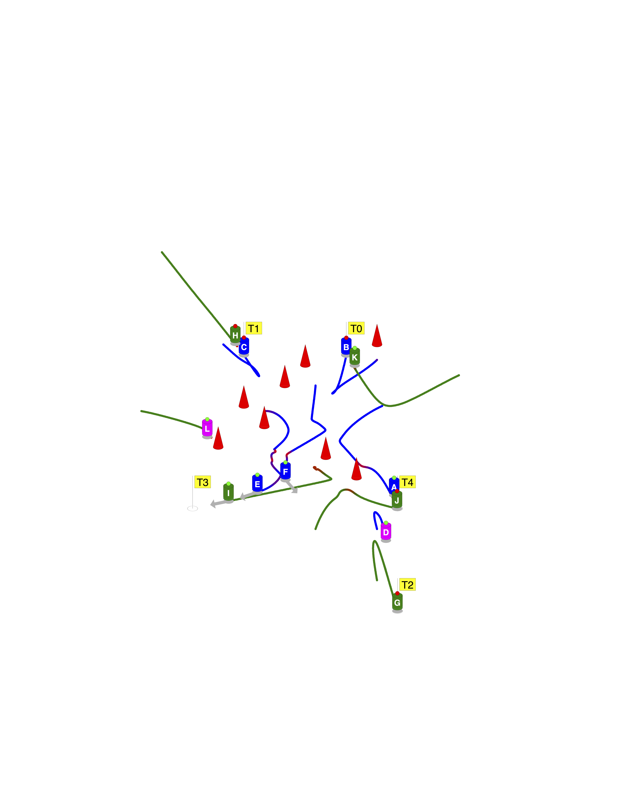

# Lost Art of PostScript
PostScript(R) and its open source cousin GhostScript are powerful tools to create custom graphics without the need for special libraries. The image below shows the  rendering of a computer simulation of self-organized team formation. The simulation program was written in Java (ca. 1999-2000). While Java was capable of screen graphics the pixalated output was not suitable for publications.

PostScript allows the definition of functions to draw the robots, flags, cones, and trajectories. These definitons are in the `preamble.ps` file. 

In order to produce grahics the simulation program can use basic _print_ functions to produce an output line with the current data. An example is shown in `data.ps`. (The interesting part is at the end of that file...) 

The concatenation for `preamble.ps`, `data.ps`, and `postamble.ps` produces the graphics.

